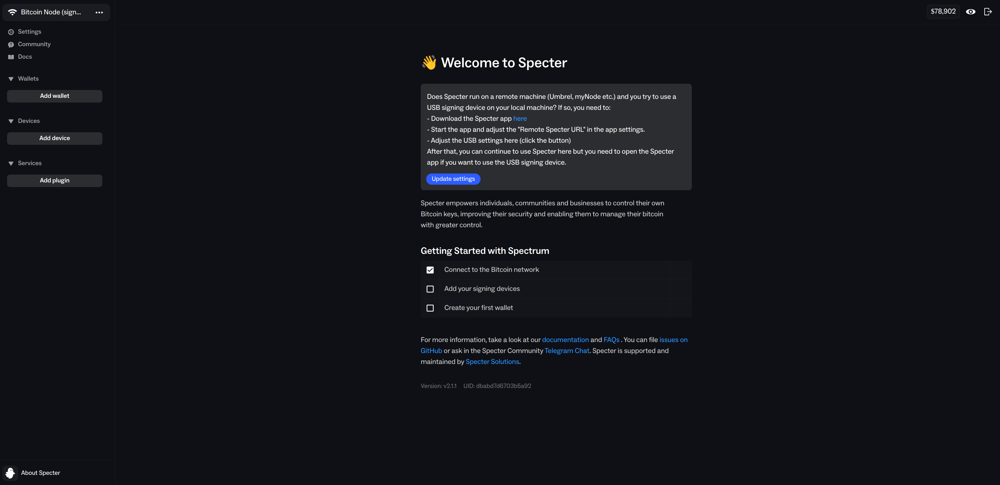

[](https://github.com/embetrix/satobox/actions/workflows/ci.yml)


## Overview

<p align ="left"></p>

Satobox is a privacy-first, open-source embedded Linux distribution purpose-built for secure Bitcoin self-custody. Built on Yocto/OE-Core, it delivers a minimal, hardened operating system optimized for running a Bitcoin node with strong privacy defaults and hardware wallet integration.

Most existing Bitcoin node solutions (e.g., Umbrel, RaspiBlitz) rely on general-purpose Debian/Ubuntu systems and large collections of precompiled packages, which can introduce additional supply-chain and security risks. Satobox takes a different approach: a small, reproducible, security-hardened OS built from source, designed to minimize attack surface and maximize transparency and user sovereignty.


### Key Features

- Bitcoin full node: [Bitcoin Core](https://github.com/bitcoin/bitcoin) with RPC and hardware wallet support
- Privacy: Integrated [Tor](https://gitlab.torproject.org/tpo/core/tor) for Bitcoin traffic privacy
- Transaction indexing: [Electrs](https://github.com/romanz/electrs) server for fast wallet indexing
- Wallet management: Integrated via [Specter Desktop](https://specter.solutions/desktop) with support for all major [hardware wallets](https://hwi.readthedocs.io/en/latest/devices/index.html#support-matrix)
- Security: Hardened with best practices
- Flexible deployment: Runs on QEMU emulation or any Linux hardware with enough RAM/CPU resources
- Reproducible builds: Yocto for consistent and reliable builds from source


<p align ="center"></p>

## Security

- Minimal system configuration with only required components and least-privilege principles
- Built entirely from source using Yocto / OE-Core (reproducible builds)
- Firewall enabled by default
- USBGuard to restrict unauthorized USB devices
- Hardened compiler and linker security flags
- Read-only root filesystem
- No SSH or login on mainnet images

Additional security mechanisms may be introduced in the future (e.g. secure/measured boot, secure storage, file system encryption) if there is community interest or real-world demand.

## Build

This layer can be integrated in your layers or built standalone using [kas-tool](https://github.com/siemens/kas):

Prerequisites:

- Container runtime: Docker or Podman
- `kas` + `kas-container`

```
pip3 install kas
```

To perform a build:

```
KAS_MACHINE=<MACHINE> kas-container build kas-satobox.yml
```

Example for raspberrypi5:

```
KAS_MACHINE=raspberrypi5 kas-container build kas-satobox.yml
```

By default Satobox is configured to use the `signet` test network.

To enable `mainnet`, set the environment variable `BTC_CHAIN="mainnet"`:

```
KAS_MACHINE=raspberrypi5 kas-container --runtime-args "-e BTC_CHAIN=mainnet" build kas-satobox.yml
```

`mainnet` requires dedicated fast storage for the full blockchain and indexing.
For Raspberry Pi deployments, use a Raspberry Pi 5 with an [M.2 HAT](https://www.raspberrypi.com/documentation/accessories/m2-hat-plus.html) and an NVMe SSD with at least **2TB** capacity.

## Flash SD Card

Flash image on a SD Card (at least 64GB) using [bmap-tools](https://github.com/yoctoproject/bmaptool):

If you are not building from scratch, you can download the prebuilt image artifacts from [GitHub Releases](https://github.com/embetrix/satobox/releases) and flash those instead.

Warning: double-check the target device before flashing (this will overwrite the selected disk).

```
sudo bmaptool copy \
     build/tmp/deploy/images/raspberrypi5/satobox-image.wic.bz2 \
     /dev/mmcblk0
```

## Run 

Insert the flashed SD card into the Raspberry Pi, connect it to your network, and power it on.

If an NVMe drive is detected (for example via an M.2 HAT), it will be automatically formatted and used for data storage.
Warning: this will erase all data on that NVMe drive.

Find the device IP address (for example from your router/DHCP leases), then open the Specter Desktop wallet management UI at:

```
https://<IP>/specter
```

Alternatively, you can access it via the device hostname:

```
https://<HOSTNAME>/specter
```

Default credentials: username `admin`, password `admin` (change this after first login).

Note: your browser will warn about the HTTPS self-signed certificate.





## Networking

Use an Ethernet connection for best Network stability and throughput.
Networking via DHCP is configured by default, just plug in Ethernet and the device will obtain an IP address automatically.

Wi-Fi is currently not supported.


## Documentation

- [Usage Guide](USAGE.md) Wallet operations, transaction management, and CLI commands
- [Disclaimer & Legal](DISCLAIMER.md) Important legal information

## Contributing

If you want to contribute changes, open a pull request at:

https://github.com/embetrix/satobox/pulls
